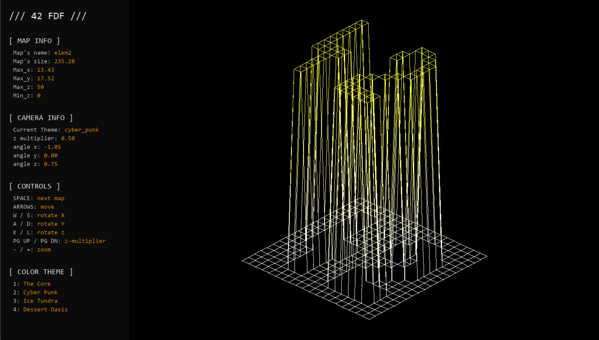
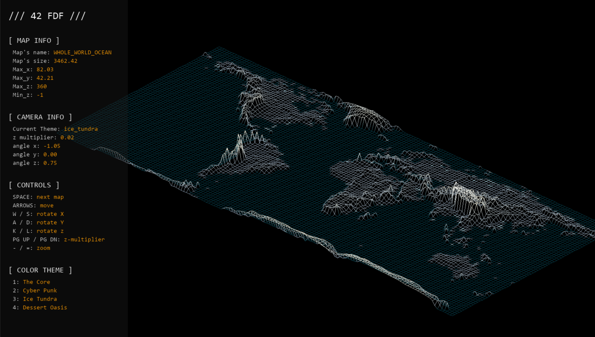

# 42-fdf


## About
"**File de Fer**," or **FDF** as 42 students call it, is my Pre Kick-Off project. This project visualizes 3D maps in a 2D window. 

The main goal is to learn how to render a 3D wireframe and handle interactions such as rotation, zoom, and moving the map. 

The core focus is understanding the math behind **isometric projection** and **line drawing techniques**.

---


## 🗺️.fdf Introduction
The .fdf file format is used to define 3D height maps for the FDF project. Each file contains a grid of numbers, where each number represents the height (z-coordinate) of a point on the map. The rows and columns of numbers correspond to the x and y coordinates on a 2D plane.

For example, a simple .fdf file might look like this:
```txt
0  0  0  0  0  0  0  0  0  0  0  0  0  0  0  0  0  0  0
0  0  0  0  0  0  0  0  0  0  0  0  0  0  0  0  0  0  0
0  0 10 10  0  0 10 10  0  0  0 10 10 10 10 10  0  0  0
0  0 10 10  0  0 10 10  0  0  0  0  0  0  0 10 10  0  0
0  0 10 10  0  0 10 10  0  0  0  0  0  0  0 10 10  0  0
0  0 10 10 10 10 10 10  0  0  0  0 10 10 10 10  0  0  0
0  0  0 10 10 10 10 10  0  0  0 10 10  0  0  0  0  0  0
0  0  0  0  0  0 10 10  0  0  0 10 10  0  0  0  0  0  0
0  0  0  0  0  0 10 10  0  0  0 10 10 10 10 10 10  0  0
0  0  0  0  0  0  0  0  0  0  0  0  0  0  0  0  0  0  0
0  0  0  0  0  0  0  0  0  0  0  0  0  0  0  0  0  0  0
```


Using .fdf files allows the program to work with any size map, making it flexible for visualizing various terrains or structures.


---

## Note on Line Drawing
Originally, FDF is intended to use **Bresenham’s line algorithm** for drawing lines. However, in Python, Bresenham caused significant lag on larger maps.

To improve performance, I replaced it with a custom draw_line function using `pygame.draw.line` with color interpolation to create a gradient effect. While this doesn’t fully replicate Bresenham’s algorithm, it achieves smoother gradient lines with slightly better performance on larger maps.


## ⌨️Controls

| Key                     | Action                         |
|-------------------------|--------------------------------|
| Arrow Keys              | Move the map                   |
| `=` / `-`               | Zoom in / out                  |
| Space                   | Next Map                        |
| ESC                     | Exit                            |
| PageUp / PageDown       | Increase / decrease Z multiplier|
| W / S                   | Rotate X                        |
| A / D                   | Rotate Y                        |
| K / L                   | Rotate Z                        |


---


## ⚙️Installation & Run
  ### Environment Requirements
  - Python 3.x
  - Pygame

  ### 📦Install Dependencies:
  Install Pygame using pip:
  ```bash
  pip install pygame
  ```

  ### 📥Clone the repository:
  ```bash
  https://github.com/gabbycommit/42-fdf.git
  ```

  ### 📂Navigate into the project folder:
  ```bash
  cd 42-fdf
  ```

  ### ▶️Run the programe
  ```bash
  python main.py
  ```
  
---

## Preview





---


## 📚 Resources & Credits:

### Coordinate system / Isometric projection / Rotation
- https://learnopengl.com/Getting-started/Coordinate-Systems?source=post_page-----464be06d6f15---------------------------------------
- https://blogs.oregonstate.edu/learnfromscratch/2021/10/05/understanding-various-coordinate-systems-in-opengl/?source=post_page-----464be06d6f15---------------------------------------
- https://youtu.be/o-xwmTODTUI?si=aqo4kHc32LfWQFIe
- https://youtu.be/AheaTd_l5Is?si=I1o-aweIRcY9rci4

### Bresenham's Line Algorithm
- https://www.bing.com/videos/riverview/relatedvideo?q=understanding+the+brehensam+line+algo&&mid=8E97ED8925FC2A1F350B8E97ED8925FC2A1F350B&FORM=VRDGAR
